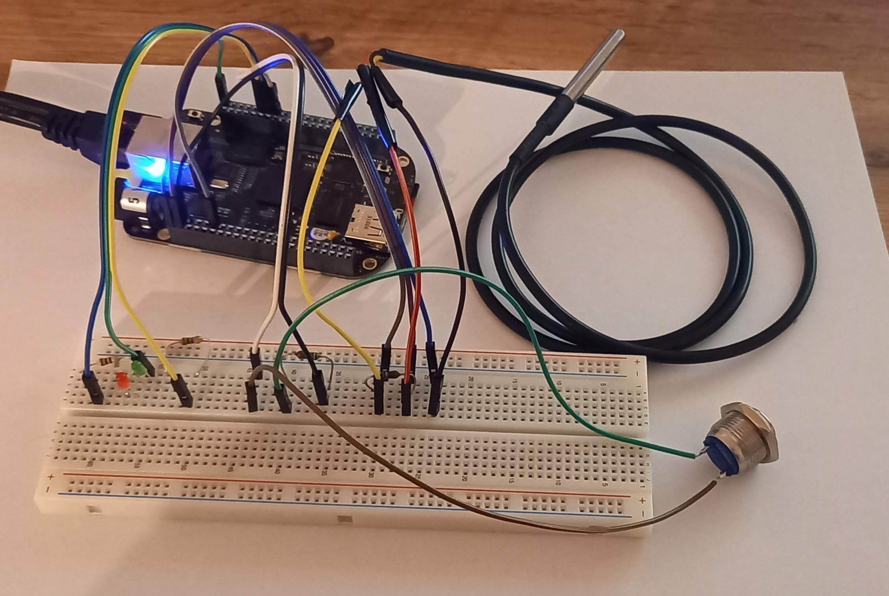

# Embedded Linux IO Demo

This project shows the usage of basic IO while using an ARM based microcontroller running embedded Linux. The BeagleBone Black was used for this implementation.


## External Components

The following external components were connected to the board:

| Component | Pin | Description |
| - | - | - |
| LED 1 | GPIO 44 | Red LED |
| LED 2 | GPIO 26 | Green LED |
| Button | GPIO 46 | Ordinary Push Button|
| Sensor | GPIO 60 | DS18B20 One-Wire Temperature Sensor |

Note: Make sure to add resistors where necessary.

## Setup

```
+------+                  +-----------------------+
| Host | <--[Ethernet]--> |        Target         | 
+------+                  +--+-----+-----+-----+--+
                             |     |     |     | 
                            Btn   LED1  LED2  Temp
```



## Prerequisite

While development, the board was equipped with the latest official Debian-based image. At the time of writing this, the version `2023-09-19` was used.

The project additionally requires the library `libgpiod` (spdx: `LGPL-2.1-or-later`). The library is used for interaction with the GPIOs for switching LEDs and reading the button state. The used Debian image ships the library in its version 1.6.2. Apparently, at least version 2.0.0 is required. You may need to compile it yourself. If so, make sure to opt-in on compiling the C++ bindings, which are mandatory. While development, version 2.0.2 was used.

The usage of the sensor requires a devicetree overlay. Fortunately, the board already comes with a set of overlays, where the one for the DS18B20 was used. You may find the overlay and the compiled version in `/opt/source/bb.org-overlays/src/arm/BB-W1-P9.12-00A0.dts` or rather `/lib/firmware/lib/firmware/BB-W1-P9.12-00A0.dtbo` within the stock Debian image. Add the overlay to uboot and restart the device.


## Target Software

The software for the target is located in the folder `target/`. An ordinary CMake configuration is provided. The folder contains a README with a few bits about the structure.

You may build the project with the following commands:

```sh
mkdir build && cd build
cmake ..
make
```

Afterwards you can start the binary `blinky` manually. With the provided `blinky.service` you can register the application to automatically start after boot. Make sure to place the binary in the folder specified in the service file.

At startup, the app will initialize its hardware. Afterwards, a socket on port 4711 will be opened for incoming connections.

With no present client connection, the green LED will blink with a frequency of 2 Hz. After a client has connected, the green LED will be switched off and the red LED stays active. Each message between the server and the client results in a blinking red LED with 4 Hz for two times.

Eeach sensor reading will be forwarded to the client. Additionally, if the temperature exceeds a predefined limit, the system will switch into its alarm state. The user may press the button to leave the alarm state. Note that if the temperature will not drop below the temperature limit, the system will stay in its alarm state.


## Host Software

On the client side a simple Python script is provided to connect to the server running on the target via a TCP connection. To connect to the server, run the script with the required `host` parameter, e.g. `main.py 192.168.1.123`. You may have a look at the README in the `host/` folder.

The script will print the received temperature messages and will request the user to press the button, in case the system went into its alarm state.


## Protocol

The protocol between the target and the host is based on strings (8bit ASCII). Each message is terminated by a newline (`\n`) character. TCP takes care of the correct message transfer and the newlines are used as a basic framing concept.

Messages from host to target:

| Type | Format | Description |
| - | - | - |
| Sensor Reading | `VAL:22.5\n` | Temperature in degree celsius |
| Alarm | `ALM:1\n` | Alarm state. 1=Alarm present, 0=Alarm cleared |


Messages from target to host are currently ignored but nevertheless initiate a blinking LED too.
